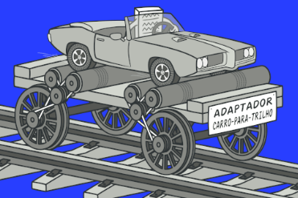

# Revisão - Arquitetura de Software

## Definição

Segundo Mary Shaw, arquitetura de software é a estrutura de estruturas de um sistema, composta por elementos, propriedades e relacionamentos. São princípios que orientam o projeto e seu desenvolvimento.

**RELACIONAMENTO**: chamadas de função, mensagens, dependência de dados;
PROPRIEDADES EXTERNAS: métodos, funções, APIs;
**ELEMENTOS**: módulos, classes, componentes, serviços;
**ESTRUTURA**: de módulos, de execução, de desenvolvimento, física;

## Benefícios de trabalhar com arquitetura

- baixo acoplamento;
- facilidade de mudança;
- reutilização de código;
- escalabilidade e desempenho;
- manutenibilidade.

## Arquiteto de Software

Responsável por definir a estrutura, as tecnologias e padrões de comunicação e coordenar a produção do software. Também garante a qualidade do produto durante  o desenvolvimento.

- traduz as demandas da empresa para o time de tecnologia;
- dão foco na solução do problema;
- um senior full stack.

## Design de Software

**Erich Gamma** - o design de software é o processo que define a estrutura e o comportamento de um sistema, sempre trabalhando com componentes reutilizáveis (design patterns).

- comunicação eficaz entre devs;
- foco em soluções POO.

**Martin Fowler** - o design de software é a estrutura que permite que o software seja compreensível, flexível e sustentável.

- refatoração;
- design patterns;
- definição dos elementos de baixo nível.

## Arquitetura x Design

A diferença é que o **design** é mais **específico**, impactando partes específicas do projeto. Foca em conseguir um **código limpo e eficiente**.
Já a **arquitetura**, é mais **geral**. As decisões impactam em **como** o software vai ser desenvolvido e na **facilidade de alteração** do código. Impacta na qualidade do sistema.

  **Design - específico, código limpo e eficiente**
  
  **Arquitetura - abrangente, fácil alteração de sistema**
  
  ## Estilos arquiteturais

Abordagens de **design** que definem como será a estrutura e a organização de um software e como seus componentes interagem.

### Benefícios

- reutilização de código;
- comunicação entre a equipe;
- flexibilidade e escalabilidade;
- padronização;
- facilidade de manutenção.

# 1. Client-Server

Server: fornece serviços / Client: consome serviços

- **Thin client**: o cliente foca na interface de usuário, deixando maior parte do processamento para o servidor;
- **Fat client**: o cliente executa parte significativa da lógica de aplicação.

	**Exemplos: sistemas web e de bancos**

# 2. Component-based
Abordagem para organizar o sistema em componentes reutilizáveis, que são desenvolvidos e implementados de forma independente.
	
#### **Benefícios:**
- reutilização;
- facilidade de manutenção.

#### **Exemplos:** 
- erp (monolito modular);
- shopify;
- wordpress;
- componentes em aplicações web

# 3. Layered 
Sistema em camadas bem definidas, cada uma com sua responsabilidade.
- presentation
- domain
- app
- infra 
- *SE DIVIDE EM CAMADAS MAS NÃO É ARQUITETURA EM CAMADAS
- possui uma única infra

# 4. N-tier (nível)
**Divisão física** entre os níveis da aplicação, onde cada camada pode estar em diferentes máquinas e servidores.
- aumenta a capacidade de lidar com uma maior carga de trabalho

### tier - divisão física 
### layer - divisão lógica

# 5. Arquitetura orientada a eventos
Neste estilo, os componentes do sistema se comunicam através de eventos (mudança de estado ou ocorrência)

- **Event producers:** geram e emitem eventos;
- **Event consumers:**  recebem e processam eventos;
- **Event channel:** gerencia a distribuição dos eventos entre os dois acima;
- **Event processors:** processam e podem gerar novos eventos.

***UTILIZADO NO SETOR DE LOGÍSTICA**

# 6. Microkernel
- núcleo simples;
- módulos e serviços externos ficam com a demanda das funcionalidades;
- comunicação feita através de mensagens

# 7. Microsserviços

- Estrutura o sistema em vários serviços independentes, cada um com sua função e se comunicando através de APIs.
- Os microsserviços são desenvolvidos, implementados e escalados de forma independente.

#### **Características:**
desenvolvimento independente;
poliglota (flopado);
desempenho e escalabilidade (maior vantagem);
descentralização;

**ESCALABILIDADE:** muitas requisições de usuários, tornando necessário criar mais instâncias de um objeto de uma só vez.

**Exemplos:** netflix, amazon e uber.

#### **Desvantagens:**
- não é possível fazer inner join;
- se algum serviço cair, não é possível reverter as ações já feitas, tem que resolver o bug;
- um build para cada microservice, o que se torna trabalhoso demais em grande escala.

# 8. Pipes and filters
Estilo de arquitetura composto por **filtros** que são **conectados por tubos**.
- **filtros:** processam dados;
- **pipes:** transportam dados entre os filtros

**exemplo:** Shell do Linux

# 9. Clean Arch (arquitetura limpa)
#### **Hexagonal - ports e adapters**  (entradas e adaptadores)
Uma versão menos desenvolvida da arquitetura limpa. Traduz para o núcleo central da aplicação, a comunicação recebida pelas regras de negócio.

- A arquitetura em camadas é orientada ao banco de dados, já a hexagonal foca nas regras de negócio. 

**A arquitetura limpa é como se fosse uma evolução da Onion, a qual é uma evolução da hexagonal.** 

### **HEXAG -> ONION -> CLEAN ARCH**

# 10. Serverless
No estilo arquitetural sem servidor, os provedores (AWS, Google Cloud) cloud são responsáveis pela execução do código.

#### **Vantagens:**
- O programador pode focar na regra de negócio sem se preocupar com infraestrutura;
- Escalabilidade automática, feita pelo provedor;
- Só paga pelo que você consome.

# Padrões arquiteturais
- Soluções prontas para problemas recorrentes.
- Mais específicos do que os estilos.

#### - MVC (model, view, controller)

#### - Plugins

#### - Three-tier (três níveis)
- nível presentation
- nível regras de negócio
- nível de dados
- **DISTRIBUÍDAS EM DIFERENTES MÁQUINAS OU SERVIDORES**

#### - Publisher-subscriber (orientado a eventos)

# Design Patterns - contexto, problema e solução
- reutilização de código;
- manutenção;
- comunicação;
- escalabilidade e flexibilidade.

#### Cuidados a tomar ao usar os design patterns:
- não tornar algo complexo demais à toa;
- não colocar um pattern em um problema que não está 100% compreendido;
- não fazer overengineering.

#### Existem 3 categorias de Design Patterns:
1. ##### Criacionais
2. ##### Estruturais
3. ##### Comportamentais

# Criacionais
## 1. Singleton
Garante que uma classe tenha apenas uma instância, fornecendo um ponto global de acesso a ela em toda a aplicação.

**Quando utilizar:** quando apenas um objeto daquela classe pode existir. 

**Exemplo:** conexões de banco de dados.

## 2. Abstract Factory
Cria famílias de objetos que têm algum tipo de relação entre si, sem especificar suas classes concretas (como se fosse uma interface - na verdade é uma interface!)

**Exemplo:** botões e checkboxes

Lembrar do **exemplo dos móveis**. As **famílias** são os móveis (**cadeira, sofá e mesa de centro**) e os **objetos** são os estilos de móveis (**artístico, vitoriano e moderno**).

**As famílias possuem um template, a partir do qual os objetos são criados e estilizados.**

## 3. Factory Method
A fábrica de métodos define um método para criar certos objetos em uma classe, permitindo que as subclasses escolham qual deles será instanciado. Nesse caso, ao invés de usar “new” para declarar um novo objeto, essa função é atribuída a métodos que são especializados nisso, como se fossem construtores dentro da classe.
Também é orientado a interface.

**Exemplo:** Uma empresa de logística possui entregas via terra e via água. Mas, ela precisa criar um método (criar transporte), que se aplica aos dois tipos de transporte oferecidos. (barcos e caminhões).

## 4. Prototype
Faz clones de uma instância existente, ao invés de criar novos objetos do zero.

**Utilizar quando** criar um objeto é caro (tempo e recursos).

## 5. Builder
Separa o processo de construção de um objeto em passos. Com ele, é possível fazer vários tipos e representações de objetos utilizando o mesmo código de construção.

#### Cria-se um construtor que, por exemplo, constrói uma casa passo a passo:
- criarTeto();
- criarParedes();
- criarGaragem();
- criarPiscina();
- criarJardim();

Porém, nem todas as casas têm piscina e nem jardim. Por isso, podemos usar apenas os passos que forem necessários para criar nossa casa.

Também, algumas casas podem ter as paredes de madeira, e algumas, de pedra. Resolvemos isto usando uma interface em comum para todos os pedreiros, independente do tipo de material que eles utilizam.

# Estruturais
## 1. Adapter
Cria adaptadores de interfaces, criando uma nova interface com as informações esperadas pelo cliente. 

**Utilizado quando** há integração de sistemas legados com novos sistemas ou adaptando uma API a uma interface.

## 2. Bridge
Digamos que você tem uma classe chamada “Forma”, e as subclasses “Quadrado” e “Círculo”. Mas agora, você quer atribuir cores a eles. Faz então as subclasses “quadrado vermelho” e “quadrado azul”, e “círculo vermelho” e “círculo azul”. Se seguíssemos essa lógica, nossa hierarquia ficaria complexa demais para ser continuada.

O pattern Bridge cria uma ponte entre as classes “forma” e “cor”, atribuindo subclasses que são “formas” e -contêm- uma “cor”.

Agora, qualquer forma pode obter a característica de qualquer cor, sem criar uma subclasse específica para ela.

## 3. Composite
Nessa estrutura, você pode compor objetos como se fossem árvores, onde cada estrutura (galho) é um objeto individual.

Trabalhando com a estrutura de árvore invertida, você cria uma interface comum, que, quando tem um método chamado, os próprios objetos passam a solicitação (ex: o preço total de um item) para baixo, até o final do galho.

## 4. Decorator (WHUPFFF!!!)
Utiliza os princípios de agregação e composição (B não vive sem A ou A controla o ciclo de vida de B) para criar uma hierarquia.

Exemplo: se você estiver com frio, pode colocar uma blusa. Se não estiver suficiente, pode colocar uma jaqueta por cima. E se começar a chover, colocar uma capa de chuva. 

Porém, entretanto, contudo e todavia, as roupas não fazem parte de você, e apenas “estendem” seu comportamento padrão. Se você quiser, pode tirar qualquer uma das peças de roupa assim que não precisar mais delas.

O exemplo do livro é o dos tipos de notificações (email, Facebook, SMS, etc) que o usuário seleciona que deseja receber.

## 5. Facade (Fachada)
Uma fachada cria uma interface simples para “esconder” um subsistema complexo e repleto de métodos e bibliotecas específicas. 

**Exemplo:** quando falamos com um atendente no telefone para realizar uma compra, o atendente é a fachada entre nós e todos os passos de realizar a compra, como entrar em contato com o depósito, embalagem, entrega, pagamento, fornecedores, impostos, etc.

#### Exemplo do cinema: Facade

## 6. Flyweight (peso pena)
**Utilizado quando** nossa aplicação precisa repetir vários objetos semelhantes sem sobrecarregar a memória RAM. Fazemos isto através de um Flyweight que contém os aspectos extrínsecos do objeto, deixando as características intrínsecas dentro deles mesmos.

**Exemplo:** as balas e mísseis do jogo de guerra que ficam no chão, e variam apenas em velocidade e posição relativa.

## 7. Proxy
O proxy permite criar um substituto para outro objeto, quando criar este objeto consome muitos recursos, por exemplo. É utilizado para controle de acesso e cache.

**Exemplo:** o **cartão de crédito** é um proxy para a **conta bancária**, a qual é um proxy para um **bolo de dinheiro**. É muito melhor para o cliente andar apenas com um pequeno cartão do que um monte de dinheiro, e é melhor para o lojista ter o dinheiro automaticamente depositado na conta do que ter o risco de ser assaltado no caminho até o banco.

**Outro exemplo:** você tem um sistema de gerenciamento de imagens que precisa exibir várias imagens em alta resolução, mas isto pode consumir muita memória e causar lentidão. 
Solução: utilizar um proxy que carrega a imagem em alta resolução apenas quando realmente necessário, como no aplicativo **Fotos do iPhone**.
